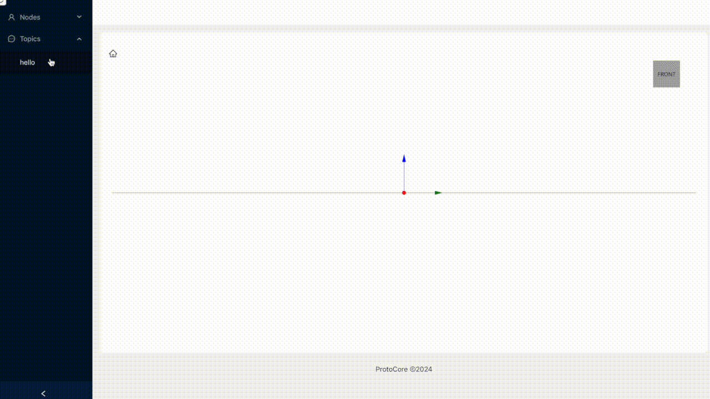
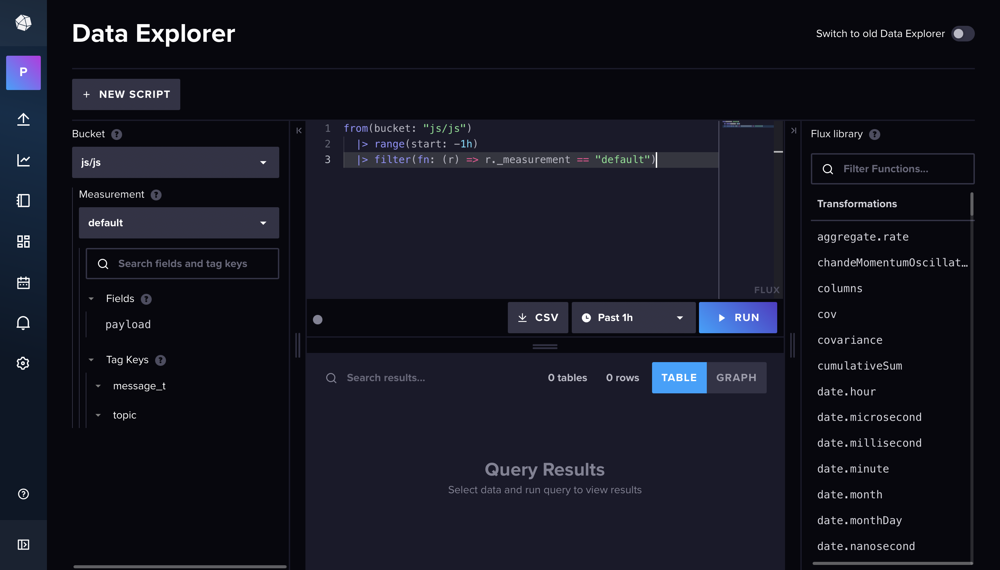
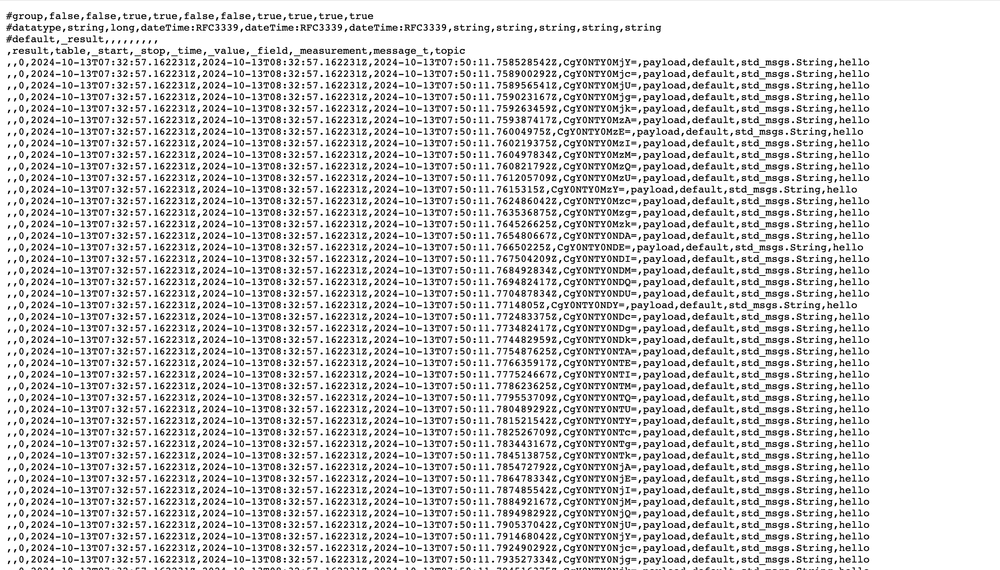

# ProtoWebViz
This project aims to build a user interface as a frontend for ProtoCore tools using React. 
It is currently under development and will be integrated with ProtoCoreJS as the backend.

I am currently developing a user interface that provides two approaches for data interaction: real-time operation and data retrieval from the database. The first approach involves saving data to the database, as shown below.

Users can operate on each topic, choosing whether to save data to the database, transfer it in real-time, or utilize both options.

Currently, I have not yet implemented the functionality to view previously saved data on the web page. However, I can confirm that the data is correctly saved by checking it in the InfluxDB UI.

I saved the data in its protobuf serialized form. While I’m not entirely sure if this is the best approach, my intention is to efficiently store the payload while conserving space.
